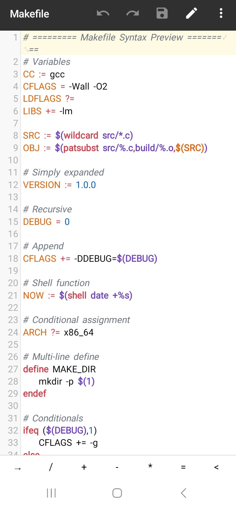
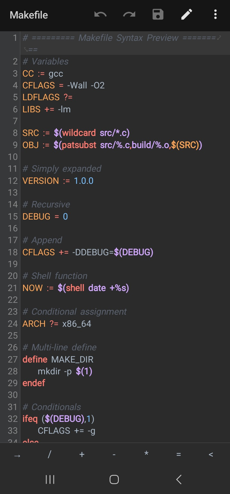

<!--
  Makefile Syntax Highlighting for MT Manager
  Author: MT-Syntax (Unofficial Organization)
  Repository: https://github.com/MT-Syntax/makefile
-->

# Makefile Syntax Highlighting

---

## About

A comprehensive `.mtsx` syntax highlighting file for **GNU Make** and **Makefile** documents, designed specifically for the **MT Manager** text editor. This definition brings accurate, desktop‑grade syntax coloring to Makefiles on your Android device.

## Features

- **Full Language Coverage**: Targets, prerequisites, variable assignments (`=`, `:=`, `+=`, `?=`), built‑in functions (`$(subst ...)`, `$(wildcard ...)`), and automatic variables (`$@`, `$<`, `$^`).
- **Conditional Blocks**: Accurate highlighting for `ifeq`, `ifneq`, `ifdef`, `ifndef`, `else`, and `endif` directives.
- **Special Targets**: Distinct styling for meta‑targets like `.PHONY`, `.ONESHELL`, `.DELETE_ON_ERROR`, and more.
- **Optimized Readability**: Carefully selected color palette that ensures clear visual distinction between different syntax elements on both light and dark backgrounds.

## Installation

1. Download the latest release archive (`makefile-v[version].zip` or `makefile-v[version].tar.gz`) from the [Releases](https://github.com/MT-Syntax/makefile/releases) page.
2. Extract the archive using a file manager (e.g., MT Manager, ZArchiver).
3. Open the extracted `.mtsx` file with **MT Manager**.
4. Tap the **Install** button when prompted.
5. Open any `Makefile`, `makefile`, `GNUmakefile`, `.mk`, or `.mak` file to see the syntax highlighting applied.  
   *Note: For files without an extension (e.g., `Makefile`), you may need to manually select the syntax via the editor menu (three dots > Syntax > Makefile).*

## Preview

### Light Theme

  

### Dark Theme

  

## Contributing

We welcome improvements and bug reports. If you encounter any missing tokens or wish to enhance the color scheme, please refer to our [Contribution Guidelines](./CONTRIBUTING.md) and feel free to open a Pull Request or Issue.

## License

This project is licensed under the [MIT License](./LICENSE). You are free to use, modify, and distribute this work, even commercially, provided that the original copyright and license notice are included.
