<!--
  Makefile Syntax Highlighting for MT Manager
-->

# Makefile Syntax Highlighting

---

## About

A comprehensive syntax highlighting file for **GNU Make** and **Makefile** documents, designed specifically for the **MT Manager** text editor. This definition brings accurate, desktop‑grade syntax coloring to Makefiles on your Android device.

## Features

- **Targets & Prerequisites**: Target names, pattern rules (with `%` wildcard), and prerequisite separation.
- **Variables**:
  - Variable definitions (`varDef`) and references (`varRef`) with distinct colors.
  - All assignment operators: `=`, `:=`, `::=`, `+=`, `?=`, `!=`.
  - Substitution references: `$(VAR:old=new)`.
- **Automatic Variables**: `$@`, `$<`, `$^`, `$*`, `$+`, `$?`, `$|`, `$%` and their `D`/`F` variants.
- **Built‑in Functions**: `$(subst ...)`, `$(shell ...)`, `$(wildcard ...)`, `$(intcmp ...)`, `$(let ...)`, and many others.
- **Directives**:
  - `define`/`endef` blocks.
  - Conditional directives: `ifeq`, `ifneq`, `ifdef`, `ifndef`, `else`, `endif`.
  - Inclusion directives: `include`, `-include`, `sinclude`.
  - Export/unexport, `override`, `vpath`, `undefine`, `private`.
- **Recipe Elements**:
  - Recipe prefix flags: `@`, `-`, `+`.
  - Shell logical operators: `&&`, `||`.
  - Shell variables: `$$HOME`, `$$(VAR)`.
- **Comments**: Comment highlighting with **TODO**/`FIXME`/`NOTE`/`XXX`/`BUG`/`HACK` markers.
- **Special Targets**: Distinct styling for `.PHONY`, `.ONESHELL`, `.DELETE_ON_ERROR`, and many other built‑in targets.
- **Literals**: Strings (with escape sequences), numbers (decimal, hex, floating‑point, scientific notation), and line continuations.
- **Optimized Readability**: Carefully hand‑picked colors for both light and dark themes.

## Installation

1. Download the latest release archive (`makefile-v[version].zip` or `makefile-v[version].tar.gz`) from the [Releases](https://github.com/MT-Syntax/makefile/releases) page.
2. Extract the archive using a file manager (e.g., MT Manager, ZArchiver).
3. Open the extracted `makefile.mtsx` file with **MT Manager**.
4. Tap the **Install** button when prompted.
5. Open any `Makefile`, `makefile`, `GNUmakefile`, `.mk`, or `.mak` file to see the syntax highlighting applied.  
   *Note: For files without an extension (e.g., `Makefile`), you may need to manually select the syntax via the editor menu (three dots > Syntax > Makefile).*

## Preview

### Light Theme

  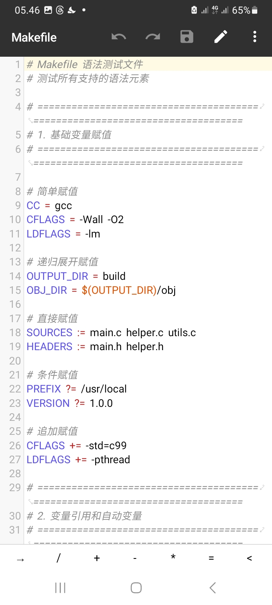

  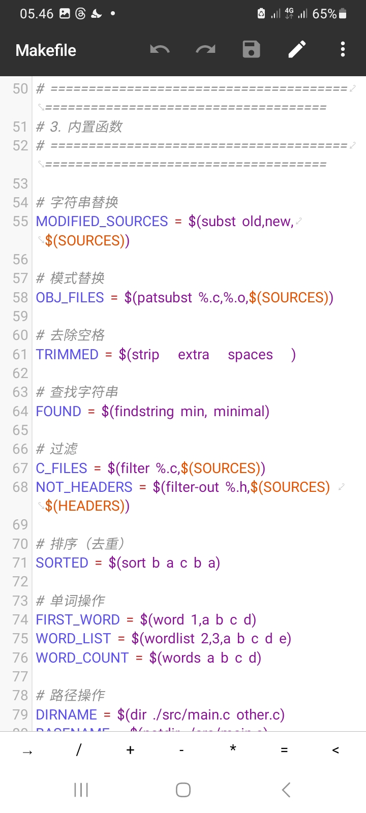

  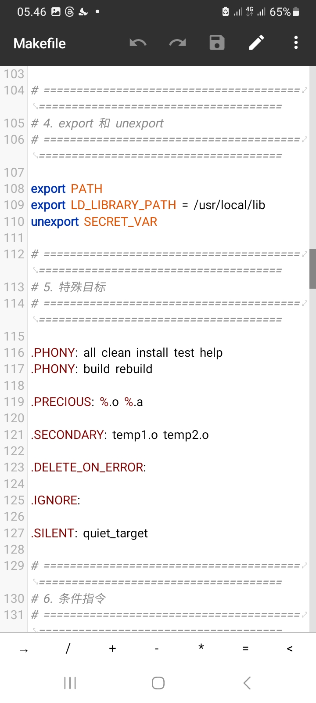

  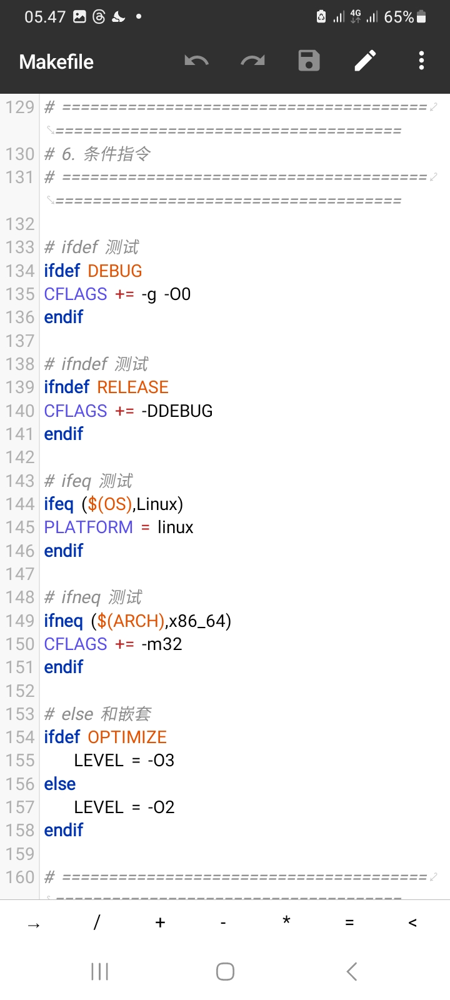

  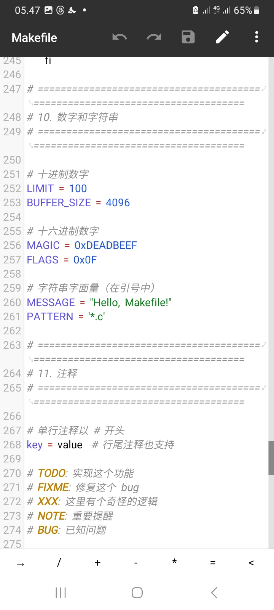

  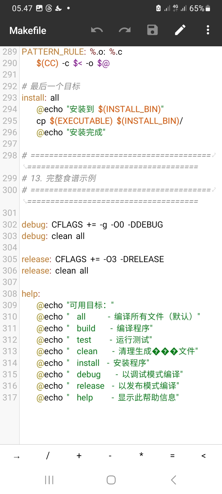

### Dark Theme

  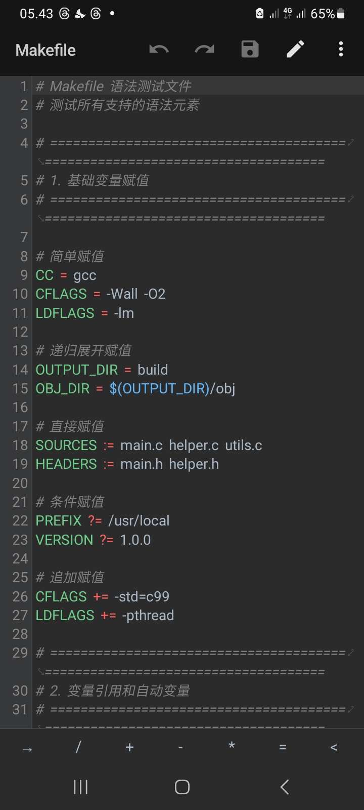

  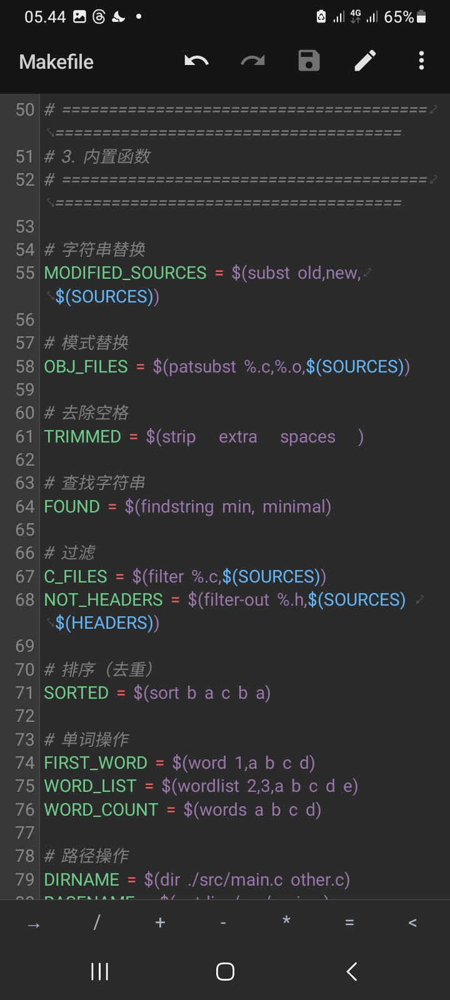

  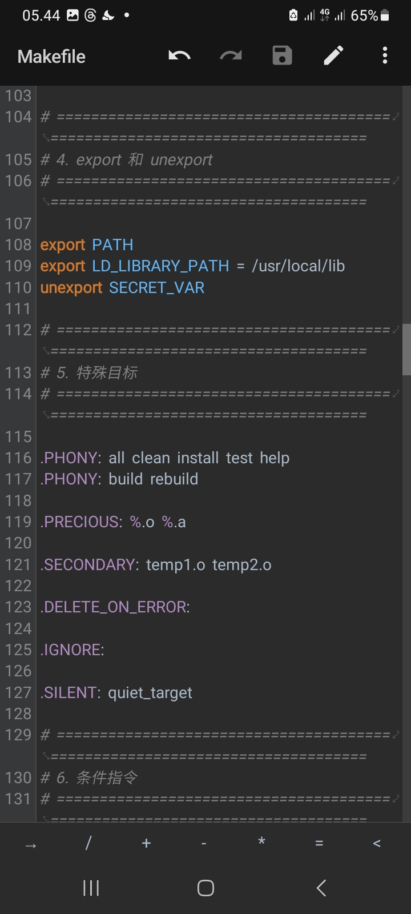

  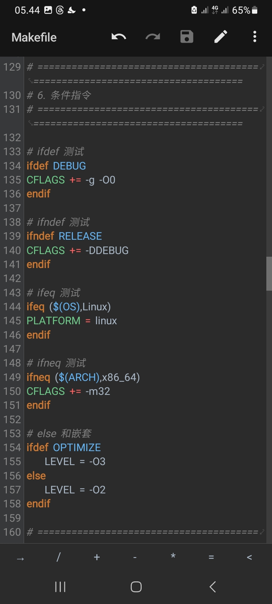

  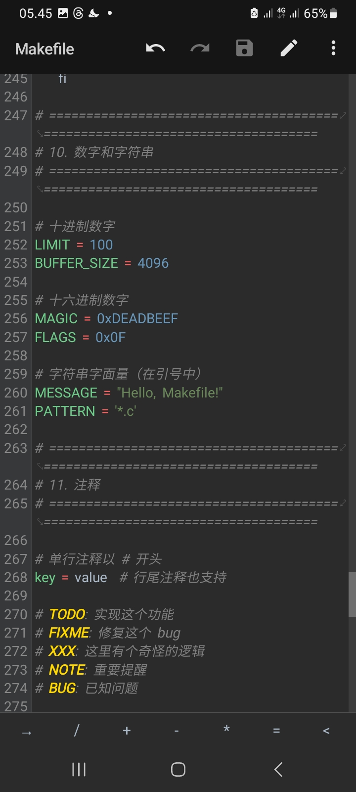

  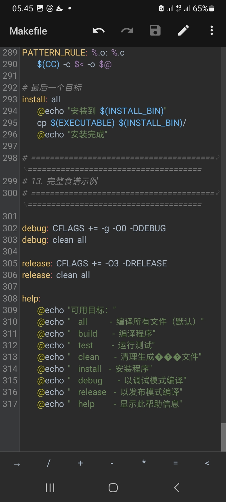

## Contributing

We welcome improvements and bug reports. If you encounter any missing tokens or wish to enhance the color scheme, please refer to our [Contribution Guidelines](./CONTRIBUTING.md) and feel free to open a Pull Request or Issue.

## License

This project is licensed under the [MIT License](./LICENSE). You are free to use, modify, and distribute this work, even commercially, provided that the original copyright and license notice are included.
